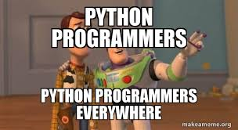

  

# Beginner Python Projects

Welcome to the Beginner Python Projects repository! This repository contains a collection of 50 beginner-level Python projects designed to help you learn and practice programming concepts while building fun and practical applications.

Each project comes with a description, implementation roadmap, and code. Feel free to explore, modify, and expand upon these projects as you continue to learn and improve your Python skills.

## Project List

Below is a list of the projects included in this repository:

| Project Name                | Project Name                | Project Name                | Project Name                | Project Name                |
| --------------------------- | --------------------------- | --------------------------- | --------------------------- | --------------------------- |
| Number Guessing Game        | Calculator                  | To-Do List App              | Basic Alarm Clock           | Simple Weather App          |
| Dice Rolling Simulator      | Guess the Word Game         | Text-Based Adventure Game   | Countdown Timer             | Web Scraping and Data Visualization |
| Currency Converter          | BMI Calculator              | Hangman Game                | Rock-Paper-Scissors Game    | Password Generator          |
| Contact Book/Address Book   | Random Quote Generator      | File Organizer              | Tic-Tac-Toe Game            | Basic Chatbot               |
| Anagram Generator           | URL Shortener               | Fibonacci Number Generator  | Palindrome Checker          | Simple Blogging Platform    |
| Unit Converter              | Calendar Application        | Text Editor                 | Hangman Game                | Simple E-commerce Store     |
| Calculator with GUI         | Memory Card Matching Game   | Snake Game                  | Basic Music Player          | Random Password Generator   |
| Morse Code Translator       | Automated Email Sender      | Quiz Game                   | Basic Paint Application     | BMI Tracker and Analyzer   |
| Expense Tracker             | Movie Recommendation System| Web Page Scraper            | Blog Post Scraper           | Web Traffic Analyzer        |
| URL Status Checker          | Birthday Reminder           | Currency Exchange Rate Tracker | Simple Drawing App        |                              |

2. Navigate to the project you're interested in and explore the code and roadmap provided.

3. Follow the implementation roadmap to build the project step by step.

4. Modify and enhance the projects as you see fit, experiment with additional features, and make them your own!

## Contributing

If you'd like to contribute to this repository, you can:

- **Add New Projects**: If you have a new beginner-level Python project idea, feel free to create a new folder and include the project description, roadmap, and code.

- **Improve Existing Projects**: If you have ideas to improve existing projects, enhance the code, or provide clearer roadmaps, feel free to submit pull requests.

## License

This repository is licensed under the [MIT License](LICENSE).

## Acknowledgments

- These projects are inspired by the learning experiences of many Python beginners.

Happy coding and learning!

## Getting Started

1. Clone this repository to your local machine using:
